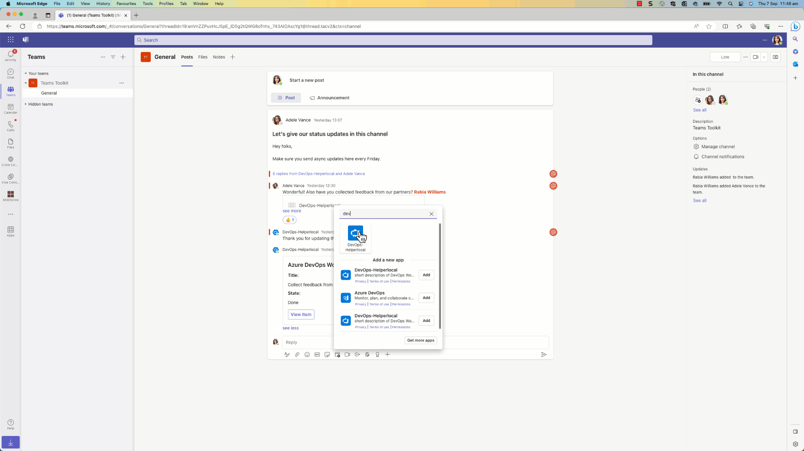

# Azure DevOps Search based message extension across Microsoft 365



## Features
- Create new work item
- Search and insert work item card with actionable buttons
- Edit existing work item to update title and status
- link unfurl for work items into card with actionable buttons

## Prerequisites

- [Node.js](https://nodejs.org/), supported versions: 16, 18
- An M365 account. If you do not have M365 account, apply one from [M365 developer program](https://developer.microsoft.com/microsoft-365/dev-program)
- [Set up your dev environment for extending Teams apps across Microsoft 365](https://aka.ms/teamsfx-m365-apps-prerequisites)
> Please note that after you enrolled your developer tenant in Office 365 Target Release, it may take couple days for the enrollment to take effect.
- [Teams Toolkit Visual Studio Code Extension](https://aka.ms/teams-toolkit) version 5.0.0 and higher or [TeamsFx CLI](https://aka.ms/teamsfx-cli)
- [Azure Devops Organization access](https://learn.microsoft.com/en-us/azure/devops/organizations/accounts/organization-management?view=azure-devops)

## Getting Started

Follow below instructions to get started with this application template for local debugging.

### Create an env file 

1.  Create an env folder 
2. Add .env.local under the env folder in the root

### Test your application with Visual Studio Code
1. Update `env/.env.local` file with below configurations.

```
AZURE_PERSONAL_ACCESS_TOKEN=<AZURE_PERSONAL_ACCESS_TOKEN>
PREVIEW_IMAGE=https://github.com/rabwill/assets/blob/main/task.jpeg
WORK_ITEM_URL=https://dev.azure.com/<orgname>/<projectname>/_workitems
ORG_NAME=<orgname>
PROJECT_NAME=<projectname>
```

1. Press `F5` or use the `Run and Debug Activity Panel` in Visual Studio Code.


## References

* [Extend a Teams message extension across Microsoft 365](https://docs.microsoft.com/microsoftteams/platform/m365-apps/extend-m365-teams-message-extension?tabs=manifest-teams-toolkit)
* [Bot Framework Documentation](https://docs.botframework.com/)
* [Teams Toolkit Documentations](https://docs.microsoft.com/microsoftteams/platform/toolkit/teams-toolkit-fundamentals)
* [Teams Toolkit CLI](https://docs.microsoft.com/microsoftteams/platform/toolkit/teamsfx-cli)
* [TeamsFx SDK](https://docs.microsoft.com/microsoftteams/platform/toolkit/teamsfx-sdk)
* [Teams Toolkit Samples](https://github.com/OfficeDev/TeamsFx-Samples)